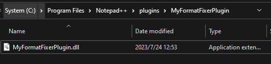
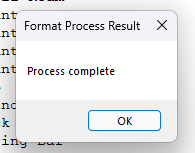

# 格式修改插件demo使用说明
步骤：
1. 编译构建生成dll文件，文件出现在vs.proj\x64\Debug文件夹中
2. 在notepad++的插件目录，一般为`C:\Program Files\Notepad++\plugins`，新建一个文件夹，命名为插件名`MyFormatFixerPlugin`
3. 复制dll文件至文件夹`MyFormatFixerPlugin`，并重命名dll文件使文件名与文件夹名一致
   
4. 打开notepad++并打开.dat文件
5. 在`Plugins`下拉菜单中可以找到`NX ASCII Database Helper`，点击`Format Database` \ 'ShowClassInTree'
6. 等待处理完成点击OK
   
7. 检查数据格式
   
